<div align="center">

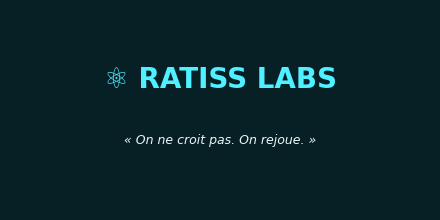

# ⚛️ RATISS-ONE — Réseaux de Neurones Intriqués + langage Ratum

**Un tissu vivant qui apprend par rencontres, un cerveau qui oublie bien, une bouche qui ne dit que ce qu'elle tient.**

[](LICENSE)
[](livre/LICENCE.md)
[](tests_verdicts.py)
[](tests_verdicts.py)
[](LANGAGE-RATUM.md)
[](RNI-DEFINITION.md)
[](RNI-DEFINITION.md)

*Par **RATISS Labs** — Jonathan Evina · Yaoundé 🇨🇲 · code MIT + livre CC-BY-SA · reproductibilité publique voulue*

</div>

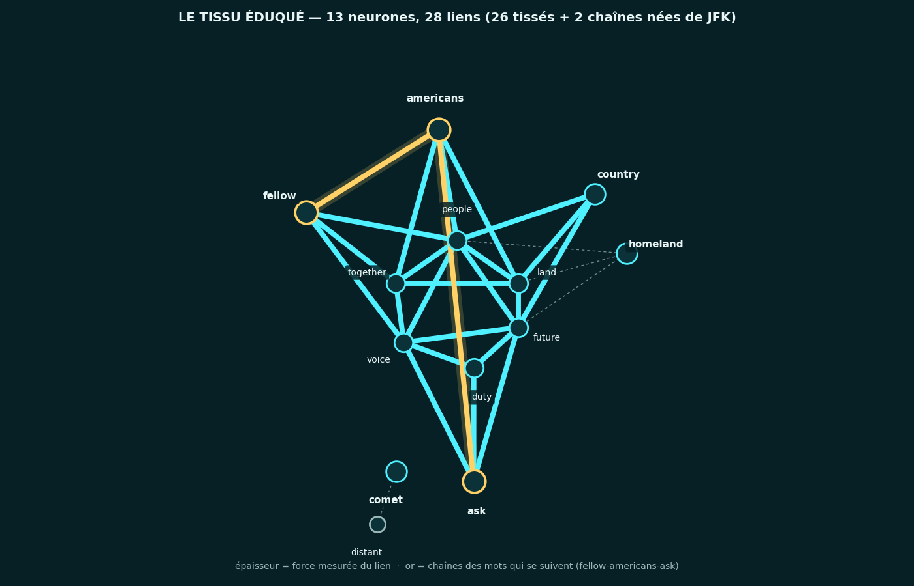

> **Résumé.** *RATISS-ONE est un programme de recherche ouvert : un réseau de
> neurones intriqué (RNI) — ni usine à prédictions, ni entrepôt de données —
> programmé dans un langage à mots français, **Ratum**. Le RNI apprend par
> rencontres sous une seule loi (ce qui se tient ensemble se renforce, ce qui
> se disjoint s'efface), entend le monde par une vraie oreille (Phonon-2),
> range ses souvenirs dans un cerveau à secteurs (tampon, entonnoir, rêve),
> et ne redit que ce qu'il tient — par une vraie bouche (Piper). 24 programmes,
> 121 contrôles verts, 32 leçons mesurées, zéro donnée stockée. Chaque affirmation
> ci-dessous se rejoue en une commande, sinon elle n'existe pas.*
>
> **Abstract (EN).** *RATISS-ONE is an open research program: an entangled
> neural network (RNI) — neither a prediction factory nor a data warehouse —
> programmed in a French-word language, **Ratum**. The RNI learns through
> encounters under a single law (what holds together strengthens, what comes
> apart fades), hears the world through a real ear (Phonon-2), files memories
> in a sector brain (buffer, funnel, dream), and only speaks what it holds —
> through a real mouth (Piper). 24 programs, 121 green checks, 32 measured
> lessons, zero stored data. Every claim below replays in one command, or it
> does not exist.*

> *« On ne croit pas. On rejoue. » — le chef. (Et quand la mesure déplaît,
> on la publie quand même. 😇)*

---

## 📚 LIRE LE LIVRE (le complet)

> **👉 [`livre/index.html`](livre/index.html) — Le Livre Complet** (ouvrir en local : fichier unique, zéro internet) :
> les 32 leçons, **20 figures**, **4 audios jouables**, les 121 contrôles un par un —
> sous licence **CC-BY-SA-4.0** (ouverte, partage à l'identique).
> **🎤 [`livre/presentation.html`](livre/presentation.html)** — les 12 slides des sommets (flèches ←/→).
> Reconstruit en une commande : `python3 livre/construire.py` → `LIVRE OK`.

---

## 📖 Sommaire

1. [La question](#-la-question) — 2. [En 30 secondes](#-en-30-secondes) —
3. [Le concept](#-le-concept) — 4. [Le langage Ratum](#-le-langage-ratum) —
5. [La boucle](#-la-boucle--du-son-au-son) — 6. [Le cerveau](#-le-cerveau--un-entonnoir-qui-oublie-bien) —
7. [Le graphe](#-le-graphe--lire-le-cerveau-penser) — 8. [L'école](#-lécole--grandir-par-phrases) —
9. [Le tokenizer](#-le-tokenizer--la-pensée-devient-phrase) — 10. [L'éclair et la rivière](#-léclair-et-la-rivière) —
11. [La marée](#-la-marée--le-jour-écoute-la-nuit-consolide) — 12. [Le rêve](#-le-rêve--garder-ce-quon-comprend) —
13. [Le second berceau](#-le-second-berceau--le-c-qui-chante-pareil-leçon-18) — 14. [Le pont FOCAL](#-le-pont-focal--mesurer-lordre-leçon-19) —
15. [Les mesures](#-les-mesures--rien-dinventé) — 16. [Les voix](#-les-voix--8-preuves-audio) —
17. [Démarrage rapide](#-démarrage-rapide) — 18. [Carte du dépôt](#-carte-du-dépôt) —
19. [Chiffres clés](#-chiffres-clés) — 20. [Ordre de lecture](#-ordre-de-lecture) —
21. [La méthode](#-la-méthode) — 22. [Feuille de route](#-feuille-de-route) —
23. [Arborescence](#-arborescence) — 24. [Citation, auteur, licence](#-citation-auteur-licence)

---

## ❓ La question

> **Peut-on comprendre sans stocker ?**

Ni bases de données, ni datasets : un **tissu** où le souvenir EST le chemin —
des neurones au destin lié, une loi d'apprentissage en mots, et des portes
bêtes (une oreille qui transcrit sans comprendre, une bouche qui parle sans
comprendre) autour d'un cœur intelligent (le tissu, qui comprend en résonnant).

Ce dépôt est la réponse mesurée, version par version : du jouet à 3 neurones
jusqu'au cerveau qui entend un discours **une seule fois** et grave ce qu'il
a compris — **sans aide**. Hypothèse de recherche, pas résultat établi sur
l'intelligence — mais chaque étape est prouvée par des programmes qui tournent.

---

## ⚡ En 30 secondes

| 🧠 | Élément | Verdict mesuré |
|---|---|---|
| 🌱 `rni-simple.ratum` | 3 neurones, 5 rencontres | forme apprise 10 → **60/100**, étrangère **0** |
| 🔥 `rni-complexe.ratum` | 8 neurones, éducation en 4 phases | SOLEIL **90**, LUNE **90**, témoin ORAGE **0** |
| 🌊 `rni-interference.ratum` | 2 formes sans rien en commun | le nouveau **chasse l'ancien** (70 → 10) |
| 🧪 `jouets/` (j01-j14) | 14 jouets, un par recoin du langage | seuils, pas, oubli, photo, choix, plafond, vagues, erreur nette, asymétrie, adaptatif, séquences, CISE |
| 📖 `vocabulaire.ratum` (v0.2) | 12 mots vrais + cousin + inconnu | **12/12 TIENT (80-90)**, cousin 40, inconnu 0 |
| 📏 `echelle/` (v0.3) | 300 neurones, 1200 liens, 50 motifs | **40/40 TIENT (75-85)**, témoins 0, 0,1 s |
| ⚖️ `v1-coexistence` (v1-loi) | symétrique vs asymétrique, même tissu | 10/10 ❌❌ → **52/52 ✅✅**, seuils 50→75→37 |
| 👂 `porte-voix/` (v1) | oreille RÉELLE Phonon-2 + pont → tissu | JFK transcrit **mot pour mot**, tissu : 22× hors vocabulaire (leçon 7) |
| 🦜 `parole.py` + `bouche/` | boucle audio → tissu → audio (Piper) | 4 mots **tenus à 90**, verdicts PARLÉS 4.9 s (leçon 8) |
| 🧠 `cerveau/` + `cerveau-demo.py` | crâne Python + pensée Ratum, secteurs VIF→REFRAIN→SANCTUAIRE | JFK live → 1 sanctuaire **f92**, résumé parlé 6 s (leçon 9) |
| 🇫🇷 `francais.ratum` + `cerveau-demo-fr.py` | route A : tissu + cerveau + bouche FRANÇAIS | 21/21 mot pour mot, sanctuaire **f92**, boucle 8.5 s (leçon 10) |
| 📚 `education/` (route B) | 37 phrases → 50 mots appris, 0 tissage manuel | **50/50 TIENT**, témoins 0, contrôles délie 3/10 → **0/50** (leçon 11) |
| 🧬 `ratum.py` v2 (route C) | loi universelle (10,3) + élastique + ombre + faucheuse | 62/93 → **93/93 sans toucher une règle** (leçon 12) |
| 💥 CISE (leçon 13) | vitesse ≥ 10 → étincelle → neurones mémoire figés + ULTRA-SECTEUR | **MAMERICANS=100 figé**, 3 nuits sans bouger, « 20 nuits : 69! » |
| 🗣️ tokenizer (leçon 14) | 5 règles sortie FR/EN + robinet à données + notebook Colab | 5 phrases pinnées, **20 paires 20/20**, Python validé |
| 🪨 marbre (leçon 15) | boucle fermée `redire()` + gravure à la 3ᵉ relecture | **f100 MARBRE**, 5 nuits, relief 13 → 35 |
| 🌊 marée (leçon 16) | tampon 50 (zéro perte) + homéostasie (mer 60) | **tempête de 70 tenue**, mer calme 0/0 |
| 💭 rêve (leçon 17) | discours réels ×1 écoute, rêve = rejoue le compris (≥ 2 mots) | sans rêve **0/0/0**, avec rêve sanctuaire en 4 nuits, élue **f91** |
| 🔬 second berceau C (leçon 18) | route D : portage C (~1000 lignes, libc seule), `-Wall -Wextra` zéro warning | **24/24 sorties identiques** + scroll identique, du 1er coup |
| 🌌 pont FOCAL (leçon 19) | tissu → 2048 bits → tore+sphère, P_sig (numpy+ripser, organes inchangés) | sanctuaire **6,23** < chaos 6,40, porteurs ×31,6 |
| 🏷️ R5 + étiquettes (leçon 20) | « J'ai entendu N » (dehors seul, rêve exclu) + noyau 5+5 gelé, sha pinné | JFK **35**, FR 30, tempête 82 ; 7 wavs régénérés |
| 🎧 direct (leçon 21) | JFK en tranches 2 s → Cerveau → règles, fenêtres chevauchantes + `--micro` | comptes **3→21**, élue « ask not » retrouvée en 4 nuits |
| 💬 dialogue (leçon 22) | 7 intents pinnés FR+EN, état+comptes enracinés tissu, inconnu honnête | « bonjour » répondu, 12 voix cousues **43,5 s** |
| 🏋️ masse (leçon 23) | 250k séquences streaming + nuit/lot, 50 mots vrais, seed 7 | **~70 s**, 12 Mo, sanctuaire conquis ; 5M ≈ 25 min sur Colab |
| ⏳ 1h Colab (leçon 24) | fichier 5M (35,7 Mo, sha) + 5M fraîches, lots 200k, 1M validé 327 s | **10M ≈ 55 min**, GPU déclaré inutile, bilan parlé |
| 🔥 puissance (leçon 25) | battement fusionné x33 + binaire 3o + 3 époques, 100M en RAM (sha) | **300M ≈ 56 min**, ~100 000/s, équivalence exacte |
| 💪 fortifié (leçon 26) | graver/relire : photo ~1 Ko (forces + traces), reprise exacte | **les muscles voyagent**, notebook grave + télécharge |
| 🏃 relais (leçon 27) | photo chaque lot sur Drive (~1 Ko), fortifié daté + bilan + voix | **zéro main**, survit aux coupures, `git pull` auto |
| 🏠 retour (leçon 28) | zip du chef relu : 300M pile, sanctuaire pinné, voix 9,5 s | **boucle fermée**, Colab → dépôt vérifié |
| ⚡ figé (leçon 29) | éclair manuel : 13 nerfs + 40 filaments, forces intactes | **marbre**, 20 nuits sans une ride |
| 🔨 école (leçon 30) | convertisseur UD->CISE : 14 450 phrases -> 247 nerfs figés | **zéro LLM**, loi 10x, 300M intactes |
| 🔀 remix (leçon 31) | 100 tours graineés sur 108k paires -> 15 549 nerfs figés | **88 s**, 36 % bu, bouche renommée |
| 🌊 fond (leçon 32) | 33 vagues jusqu'à 0 restant -> 24 639 nerfs, 105 349 liens | **100 % bu**, 48 s, ordre indifférent |
| 📚 `livre/` (leçon mère) | le livre complet auto-reconstruit | 32 leçons, 20 figures, 4 audios, slides, CC-BY-SA |
| ⚙️ `tests_verdicts.py` | la batterie | 24/24 programmes, **121/121 contrôles verts** |

---

## 🧵 Le concept

**Le constat** : on entraîne des géants sur des données qu'on stocke par
milliards. Ici, l'inverse : **le transcrit vit en RAM le temps d'un run
(comme une charge) et meurt ; seules les forces des liens persistent (comme
des synapses)**. La mémoire long terme du RNI, c'est le chemin — pas la
cargaison.

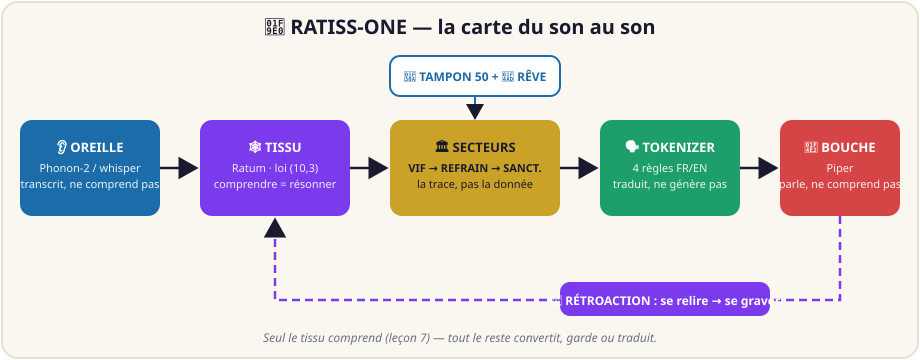

**La loi** (une seule, en mots, pas en formules) : *ce qui se tient ensemble
se renforce, ce qui se disjoint s'efface.* En v2 elle est universelle et
mesurée : `lie` = +10 (élastique), `délie` = −3, ombre (moitié perdue par
saut), oubli −3 — calibrés par l'expérience de coexistence (le symétrique
s'effondre 10/10, l'asymétrique tient 52/52).

**L'honnêteté radicale** : ce n'est PAS de la physique quantique (jamais de
qubits : des compteurs, des seuils et des nuits), PAS de la neurobiologie
(des compteurs à seuil, pas des cellules) — et quand la saturation à 95
déplaît, on la publie… puis on la creuse (relief 35, § marée).

---

## 🗣️ Le langage Ratum

**Ratum parle français** (`tissu`, `neurone`, `lien`, `rencontre`,
`propager`, `renforcer`, `oublier`, `juger`…). Un programme Ratum se lit
comme une histoire d'éducation : on tisse, on rencontre, on renforce, on
oublie, on juge — et le verdict tombe : **TIENT** ou **ROMPT**. Une
vingtaine de relations : la faucheuse `nettoyer` (19ᵉ) arrache les liens
morts (*nommer, c'est protéger*), l'étincelle `cise` (20ᵉ) fige la vitesse
en mémoire.

**Deux maisons** (décision du chef) : l'école (`delie 0` — l'éducation
sélective) et la vie (`10, 3` — la coexistence). Entre les deux, la
**falaise délie** : dès délie 1, 0/50 — aucun compromis doux ne survit.
Spécification complète : [`LANGAGE-RATUM.md`](LANGAGE-RATUM.md) ·
interprète : `ratum.py` (495 lignes, zéro dépendance).

---

## 🔁 La boucle : du son au son

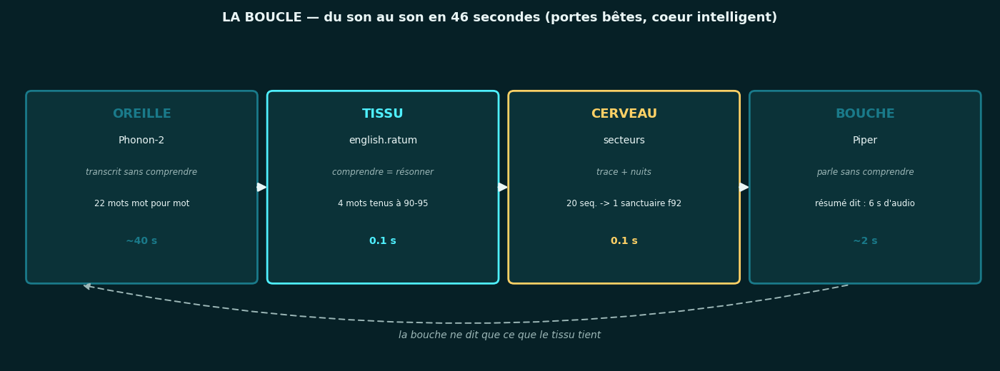

JFK parle 11 secondes → l'oreille transcrit mot pour mot → le tissu résonne
(4 mots tenus) → le cerveau trace et consolide (20 séquences → 1 sanctuaire)
→ la bouche dit le résumé (6 s d'audio). Boucle totale : **46 s**, dont
40 s d'oreille, 0.1 s de pensée, 2 s de bouche.

**Des portes bêtes, un cœur intelligent** — comme dans la tête (voir
`CERVEAU.md`) : Phonon transcrit sans comprendre, Piper parle sans
comprendre, **seul le tissu comprend** (leçon 7 : *transcrire n'est pas
comprendre*). Preuves : `preuves/sortie-cerveau-demo.txt`,
`bouche/cerveau.wav`.

---

## 🧠 Le cerveau : un entonnoir qui oublie bien

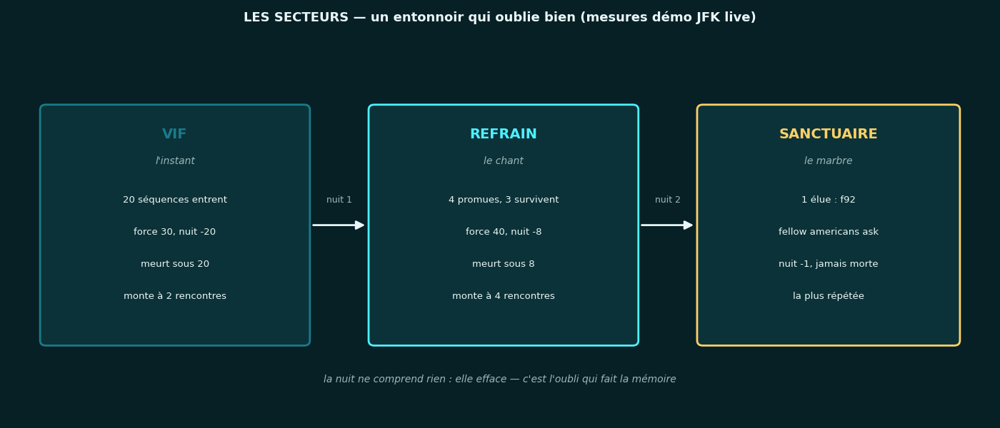

Le tissu est enfermé dans un crâne à secteurs (décision du chef :
**Python = le crâne** qui tient le graphe, **Ratum = la pensée** qui bat).
Chaque entrée devient une **trace** — quels mots, quel ordre, combien de
fois, quelle force — jamais la donnée brute.

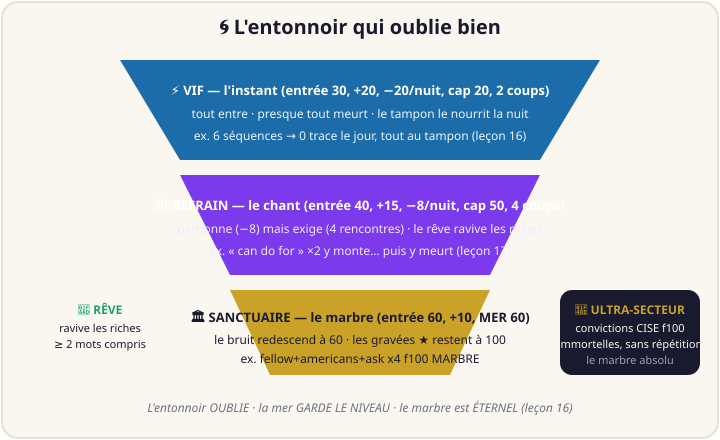

| Secteur | Entrée | +/rencontre | −/nuit | Monte si… |
|---|---|---|---|---|
| **VIF** (l'instant) | 30 | 20 | 20 | 2 rencontres |
| **REFRAIN** (le chant) | 40 | 15 | 8 | 4 rencontres |
| **SANCTUAIRE** (le marbre) | 60 | 10 | **mer 60** (1 + (f−60)//4) | sommet (immortel) |
| **ULTRA-SECTEUR** (le marbre absolu) | 100 | 0 | 0 | convictions CISE (sans répétition) |

Mesures live : 20 séquences entrent, 4 montent au refrain, **1 atteint le
sanctuaire** (`fellow americans ask`, f92) — la plus répétée, pas la
première ni la dernière. Puis le tampon (v5) retient le jour et vide la
nuit, le rêve (v6) ravive les riches, la gravure (v4) rend éternel.
*La nuit ne comprend rien : elle efface — c'est l'oubli qui fait la mémoire.*
Doctrine complète : `cerveau/SECTEURS.md`.

---

## 🕸️ Le graphe : lire le cerveau penser

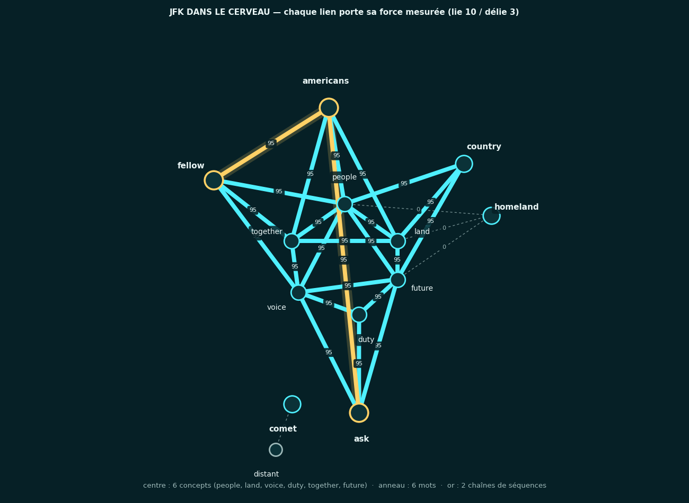

Le graphe ci-dessus n'est pas un schéma : c'est **le tissu réel après la
démo** — 13 neurones (6 concepts au centre, 6 mots en anneau), 28 liens,
chaque lien portant sa force mesurée. En or : les 2 chaînes nées des mots
qui se SUIVENT (`fellow-americans-ask`).

**Lecture honnête, mise à jour** : l'éducation commune avait saturé presque
tous les liens à **95** (vrai défaut, publié tel quel) — puis les phases
3-5 l'ont **creusé** : la statue gravée reste à 100, le bruit coule à la
mer (60), **relief 35**. Les liens de `homeland` — mot tissé mais jamais
entendu — restent **morts à 0** (pointillés gris). Le système montre ses
forces, ses morts… et ses cicatrices : c'est ça, une mesure.

> Ces figures sont régénérées depuis le code, jamais dessinées à la main :
> `python3 outils/figures.py` rejoue la démo hors-ligne, **assert** les
> nombres live (20 séq., 28 liens, sanctuaire f92), puis trace. Si la démo
> change, les figures refusent les vieux nombres.

---

## 📚 L'école : grandir par phrases

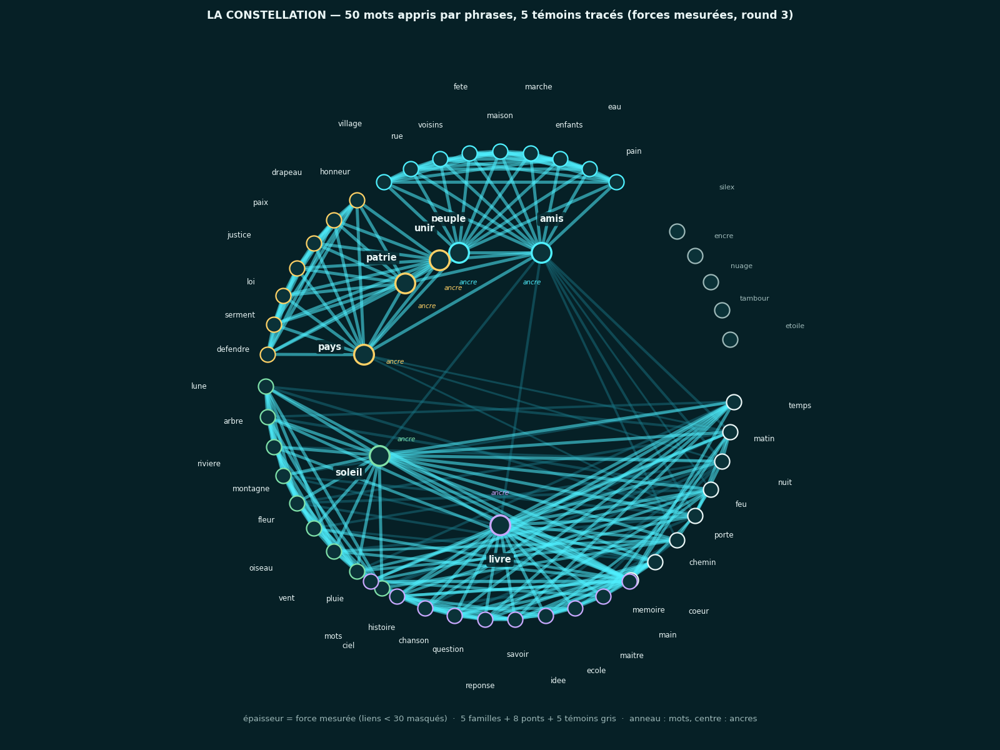

Fini le tissage à la main : **37 phrases** font naître 50 neurones et 247
liens — après 3 rounds + 2 nuits, **50/50 TIENT** (seuil 60), 6 témoins à 0.

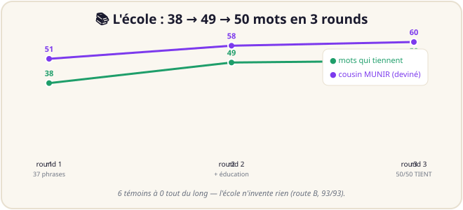

Courbe d'apprentissage **38 → 49 → 50**, cousin MUNIR deviné 51 → 58 → 60.
Le contrôle tue : délie 3 ou 10 → **0/50** (la falaise). Trois calibrages,
trois usages : (10,10) éducation commune, (10,3) coexistence, (10,0) école.
Preuves : `education/EDUCATION.md`, `preuves/sortie-education*.txt`.

---

## 🗣️ Le tokenizer : la pensée devient phrase

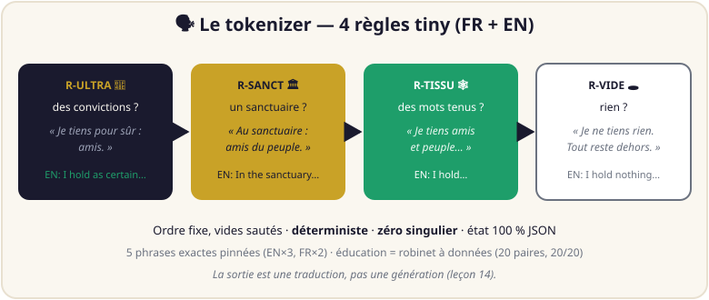

La sortie est une **traduction, pas une génération** : 5 règles ordonnées,
déterministes, zéro singulier — **5 phrases exactes pinnées** (EN×3, FR×2).
Le vrai problème (la DONNÉE) est résolu par construction : le tissu
déterministe **fabrique ses propres paires** — `donnees/generer.py` :
**20 paires, 20/20 vérifiées**. Le générateur est versionné, la masse ira
sur Colab. 🔊 [`bouche/preuve-tokenizer.wav`](bouche/preuve-tokenizer.wav) ·
Règles : [`TOKENIZER.md`](TOKENIZER.md).

---

## ⚡ L'éclair et la rivière

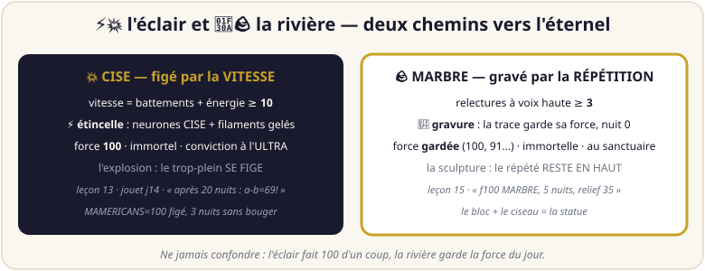

Deux chemins vers l'éternel, à ne jamais confondre : **l'éclair** (💥 CISE)
fige par la VITESSE (≥ 10 battements + énergie → f100 à l'ULTRA), **la
rivière** (🪨 MARBRE) grave par la RÉPÉTITION (3 relectures à voix haute →
force gardée, nuit 0, au sanctuaire). Le sanctuaire est le BLOC, la
rétroaction est le CISEAU, la gravure est la STATUE. 🔊
[`bouche/preuve-marbre.wav`](bouche/preuve-marbre.wav) (le gravé après 5 nuits).

---

## 🌊 La marée : le jour écoute, la nuit consolide

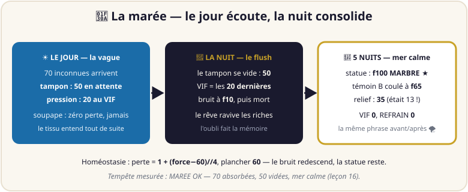

Le tissu entend tout de suite, les traces attendent au **TAMPON** (50
écoutes) et descendent le soir — soupape **zéro perte**. Le sanctuaire a un
**niveau de la mer** (60) : perte = 1 + (f−60)//4, plancher 60.

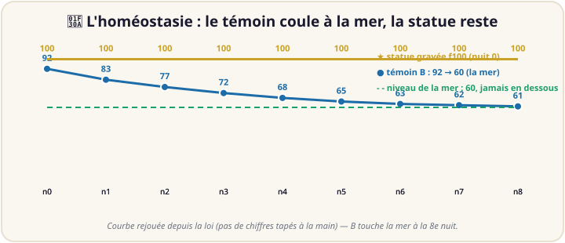
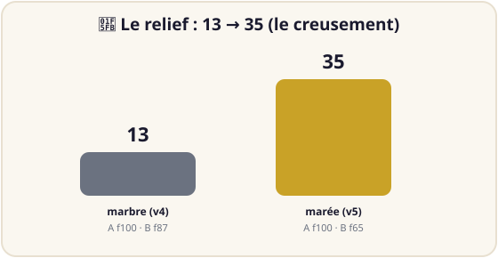

Mesuré : **tempête de 70 inconnues** → tampon 50 + pression 20 → nuit → VIF
= 20 dernières à f10 → 5 nuits → statue **f100 MARBRE**, témoin f65,
**relief 35** (était 13), mer calme (VIF 0, REFRAIN 0). La même voix avant
et après la tempête (seul le compteur change, 12 → 82) : la stabilité incarnée. 🔊
[`bouche/preuve-tempete.wav`](bouche/preuve-tempete.wav).

---

## 💭 Le rêve : garder ce qu'on comprend

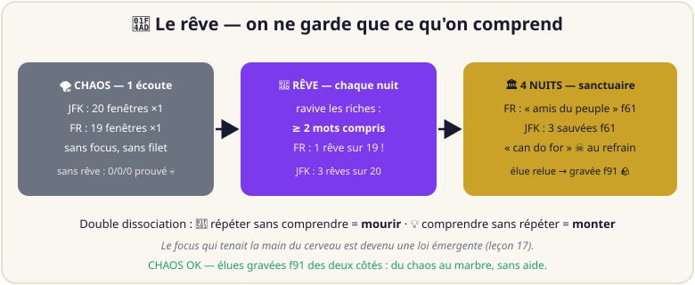

Le baptême du feu : JFK + discours FR entendus **UNE fois, sans focus**.
Sans rêve : oubli TOTAL prouvé (**0/0/0**). Avec rêve (chaque nuit ravive
les riches, ≥ 2 mots compris) : sanctuaire en **4 nuits** — FR : « amis du
peuple » seule (f61) ; JFK : 3 sauvées (f61) pendant que « can do for »
(×2, 0 compris) **meurt au refrain**. Double dissociation : répéter sans
comprendre = mourir, comprendre sans répéter = monter. L'élue est gravée
**f91** : du chaos au marbre, sans aide. 🔊
[`bouche/preuve-chaos.wav`](bouche/preuve-chaos.wav).

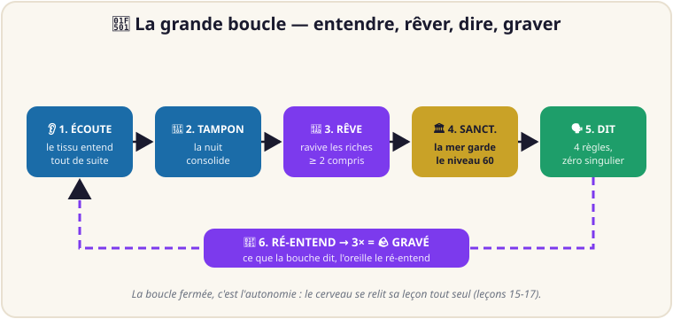

---

## 🔬 Le second berceau : le C qui chante pareil (leçon 18)

*Route D — `route-d/ratum.c` (~1000 lignes, que la libc) + `route-d/conformite.py`.*

Une spec saine a deux implémentations indépendantes et identiques. Le
portage C rejoue les 24 programmes du corpus et sort **exactement** comme
Python : loi (10,3), élasticité, ombre //200, tris, pluriels, et même le
JSON `indent=1` de `graver` répliqué à l'octet — compilé `gcc -O2
-Wall -Wextra` **zéro warning**, conforme **du premier coup**.

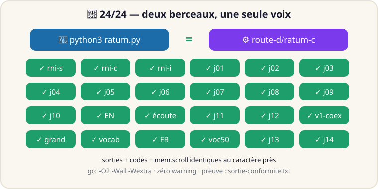

- **24/24 sorties identiques** au caractère près (codes + `mem.scroll`)
- 5 divergences hors corpus documentées (`route-d/LISEZ-MOI.md`), jamais déclenchées
- Preuve : [`preuves/sortie-conformite.txt`](preuves/sortie-conformite.txt) — contrôle batterie ✅

---

## 🌌 Le pont FOCAL : mesurer l'ordre (leçon 19)

*`pont-focal/encodeur.py` (stdlib) + `pont-focal/pont.py` (numpy, ripser, organes inchangés).*

Le tissu traverse le vrai univers FOCAL : sa trace relationnelle (quels
mots, quel ordre, quelle force — jamais la donnée brute) devient 2048 bits
déterministes, projetés sur le fond tore+sphère, mesurés en P_sig. Première
mesure : le compteur bouge (delta 0,17) et le sanctuaire projette **plus
calme que le chaos** (6,23 < 6,40). Piste v1 honnête, pas un théorème.

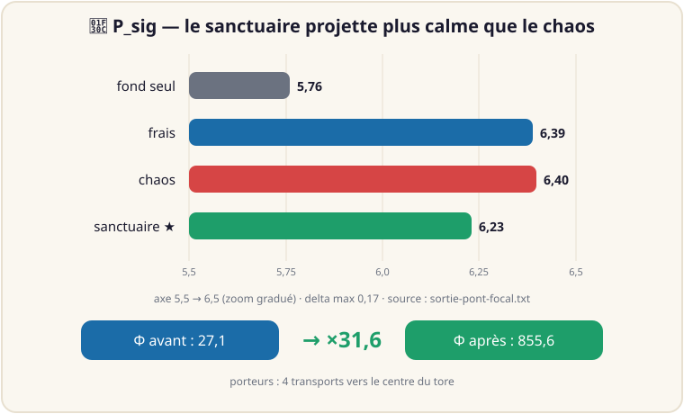

| tissu | P_sig | sha16 des bits |
|---|---|---|
| fond seul | 5,76 | — |
| frais | 6,39 | `e098de14fc25fbed` |
| chaos | 6,40 | `f29a73ec25dbdb98` |
| sanctuaire | **6,23** | `f555dd714bc1bf0b` |
| porteurs (×4 transports) | Φ 27,1 → **855,6 (×31,6)** | — |

Preuve : [`preuves/sortie-pont-focal.txt`](preuves/sortie-pont-focal.txt) — contrôle batterie ✅

---

## 📊 Les mesures : rien d'inventé

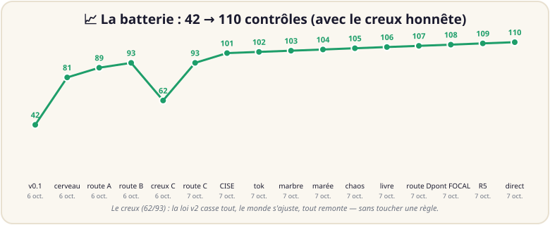
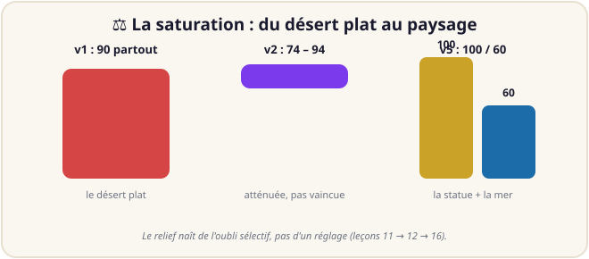

**121 contrôles** : 97 (24 programmes : codes + phrases pinnées + interdits
absents) + 24 (pont voix, éducateur, 6 autotests cerveau/bouche/marbre/marée/
chaos, livre, conformité C, pont FOCAL, étiquettes, direct, dialogue, masse, notebook 1h, rapide, fortifié, relais, retour, figé, école, remix, fond). Le creux 62/93 de la route C est publié comme le reste.
Détail un par un : **livre §10** + `tests_verdicts.py`.

---

## 🎙️ Les voix : 8 preuves audio

| Fichier | Ce qu'on entend |
|---|---|
| [🔊 `bouche/cerveau.wav`](bouche/cerveau.wav) | « I heard 35 sequences. In the sanctuary: fellow americans ask. I hold americans, country, fellow and ask… » (JFK, 9.0 s) |
| [🔊 `bouche/cerveau-fr.wav`](bouche/cerveau-fr.wav) | « J'ai entendu 30 séquences. Au sanctuaire : amis du peuple. Je tiens amis, peuple, pays et patrie… » (discours→résumé, 8.6 s) |
| [🔊 `bouche/verdicts.wav`](bouche/verdicts.wav) | « I hold fellow, americans, ask and country. The rest stays outside. » (le perroquet) |
| [🔊 `bouche/preuve-tokenizer.wav`](bouche/preuve-tokenizer.wav) | « I heard 12 sequences. In the sanctuary: fellow americans ask. I hold… » (8.8 s) |
| [🔊 `bouche/preuve-marbre.wav`](bouche/preuve-marbre.wav) | « I heard 12 sequences… » dite par le gravé après 5 nuits (9.3 s, compteur fixe) |
| [🔊 `bouche/preuve-tempete.wav`](bouche/preuve-tempete.wav) | « I heard 82 sequences… » — la tempête entendue, la voix stable (8.6 s) |
| [🔊 `bouche/preuve-chaos.wav`](bouche/preuve-chaos.wav) | « I heard 20 sequences. In the sanctuary: americans ask not… » — l'élue du chaos (8.8 s) |
| [🔊 `bouche/dialogue.wav`](bouche/dialogue.wav) | « Bonjour ! Moi c'est RATISS… » — 12 répliques FR+EN cousues (43,5 s) |

Voix EN : Piper lessac-medium (hors-ligne). Voix FR : siwis-medium restaurée,
[`cerveau-fr.wav`](bouche/cerveau-fr.wav) 8.6 s, « J'ai entendu 30 séquences » (R5).

---

## 🚀 Démarrage rapide

```bash
git clone https://github.com/jonathansearch/RATISS-ONE.git
cd RATISS-ONE
python3 ratum.py rni-simple.ratum        # le minimal : 3 neurones
python3 ratum.py english.ratum          # le tissu : TIENT / ROMPT / cousin 36
python3 tests_verdicts.py               # 121 contrôles (24 programmes + 16 système)
python3 cerveau/autotest_chaos.py       # le chaos : 0/0/0 puis élues f91
python3 livre/construire.py             # LE LIVRE : courbes + livre + slides
python3 bouche/regles.py --chaos       # l'élue parle (+ --wav f.wav)
```

Zéro dépendance pour le cœur : que du Python standard. Déterministe : mêmes
entrées, mêmes sorties, toujours.

**La démo live** (oreille + bouche, ~46 s, protocole dans
`porte-voix/PROTOCOLE-OREILLE.md`) :

```bash
python3 cerveau-demo.py                 # JFK → secteurs → résumé parlé
```

---

## 🗺️ Carte du dépôt

| Dossier / fichier | Rôle | Preuve |
|---|---|---|
| `ratum.py` | interprète de référence (la pensée) | 24/24 programmes |
| `LANGAGE-RATUM.md` | spec : une vingtaine de relations en mots | — |
| `rni-*.ratum`, `jouets/` (j01-j14), `vocabulaire.ratum`, `echelle/` | les 4 âges : minimal → jouets → mots → échelle | `preuves/sortie-*.txt` |
| `porte-voix/` | l'oreille : Phonon-2 (EN) + faster-whisper (FR) + pont → tissu + **direct** (tranches 2 s + `--micro`) | `preuves/transcription-jfk.txt`, `-discours.txt`, `sortie-oreille-direct.txt` |
| `parole.py`, `bouche/` | le tokenizer (5 règles) + bouche Piper + 8 voix | `bouche/preuve-*.wav` |
| `cerveau/`, `cerveau-demo.py`, `-fr.py` | le crâne : tampon + secteurs + rêve + nuits (EN + FR) | `preuves/sortie-cerveau-demo(-fr).txt` |
| `education/` | l'école : corpus 39 phrases + éducateur → 50 mots | `vocabulaire50.ratum`, `images/constellation.png` |
| `donnees/` + `TOKENIZER.md` | le robinet : paires état→phrase + règles + notebook Colab | 20 paires, 20/20 |
| `RNI-DEFINITION.md` | la fiche scientifique : définition + 32 leçons + roadmap | — |
| 📚 `livre/index.html` | **LE LIVRE** : tout (32 leçons, 20 figures, 4 audios jouables, CC-BY-SA) | `livre/presentation.html` (slides) |
| `CERVEAU.md` | la carte d'inspiration cerveau → organes | — |
| `univers-focal/` | les 4 organes FOCAL (référence d'inspiration) | — |
| `route-d/` | le second berceau : Ratum en C, mêmes sorties au caractère près | `preuves/sortie-conformite.txt` (24/24) |
| `pont-focal/` | tissu → 2048 bits → P_sig : le compteur d'émergence | `preuves/sortie-pont-focal.txt` (6,23 < 6,40) |
| `README-figures/` | les 2 images du README, générées (pas dessinées) | `fabriquer.py` |
| `outils/figures.py` | régénère les figures PNG depuis les mesures | `images/*.png` |
| `livre/construire.py` | régénère courbes + livre + slides (déterministe) | `LIVRE OK` |
| `tests_verdicts.py` | la batterie : 121 contrôles | `121/121 CONTRÔLES VERTS` |
| `dialogue/` | on lui parle, il répond (7 intents + conversation scriptée) | `preuves/sortie-dialogue.txt`, `bouche/dialogue.wav` |
| `education-massive/` | générateur seed 7 + éducateur streaming (masse sur Colab) | `preuves/sortie-masse-250k.txt` |
| `MANIFESTE.json` | SHA-256 de chaque fichier (sceau du labo) | — |

---

## 📏 Chiffres clés

- **121/121 contrôles verts**, 24 programmes, 32 leçons (v0.1 → remix-v1 → fond-v1)
- **Pipeline bilingue** : EN (JFK, boucle 46 s) + FR (discours, 21/21, boucle 8.5 s), sanctuaire f92 des deux côtés
- **50 mots éduqués** : 37 phrases → 63 neurones, 273 liens, courbe 38→49→50, 6 témoins à 0
- **300 neurones / 1200 liens** : 40/40 TIENT à 75-85 en 0,1 s (v0.3)
- **Relief 35** : statue f100, mer 60 — la saturation 90 → 74-94 → creusée
- **Tempête 70 tenue** : tampon 50 + pression 20, zéro perte, mer calme 0/0
- **Chaos sans aide** : 1 écoute → 0/0/0 sans rêve, sanctuaire + élue f91 avec rêve
- **46 s** de son à son : oreille 40 s, pensée 0.1 s, bouche 2 s (cerveau)
- **Organes légers** : Phonon-2 0.16 Go + voix Piper 0.06 Go, zéro dataset
- **Zéro donnée stockée** : le brut meurt en RAM, seules les forces persistent

---

## 📖 Ordre de lecture

1. 📚 `livre/index.html` (le complet : 32 leçons, 20 figures, 4 audios) → 2. ce README (la carte)
2. `RNI-DEFINITION.md` (la fiche : définition + 32 énoncés) → 4. `LANGAGE-RATUM.md` (les relations)
3. `jouets/` (14 histoires d'éducation) → 6. `CERVEAU.md` (cerveau → organes)
4. `cerveau/SECTEURS.md` (la doctrine) → 8. `TOKENIZER.md` (les 5 règles)
5. `preuves/` (le carnet du labo : chaque sortie rejouable en une commande)

---

## 🔬 La méthode

- **R7 : une commande suffit.** Chaque résultat se rejoue (`python3
  tests_verdicts.py`, `python3 cerveau-demo.py`) — sinon il n'existe pas.
- **Les mots d'abord.** Pas de formules : le langage du labo, ce sont des
  phrases et des verdicts (TIENT/ROMPT).
- **Les échecs se publient.** Vocabulaire séquentiel (marge 0), échelle ×6
  (0 forts), interférence j13 v1 (a-b=10), creux 62/93 : tous documentés,
  tous dépassés.
- **Simulation ≠ matériel.** Tout ici est calcul déterministe sur CPU ; si un
  jour le tissu touche une QPU, ce sera dit à voix haute.
- **Ce qu'on ne prétend PAS** : pas de quantique, pas de neurones
  biologiques, pas de conscience — des compteurs qui tiennent ou qui rompent.

---

## 🗺️ Feuille de route

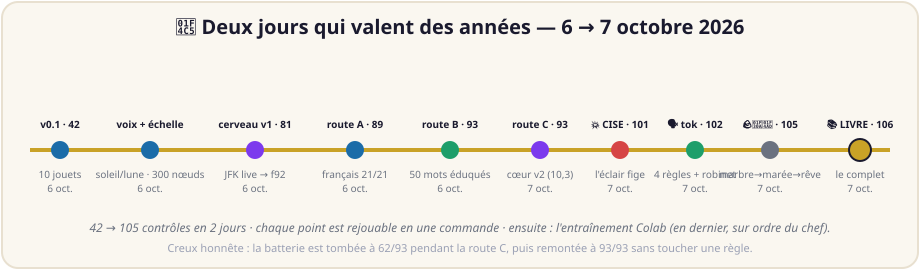

- [x] **v0.1** — spec stabilisée sur 10 jouets (42/42 verts)
- [x] **v0.2** — vocabulaire tissé à la main (12 mots, cousin 40, inconnu 0)
- [x] **v0.3** — passage à l'échelle mesuré (300 nœuds, 40/40, 0,1 s)
- [x] **v1-loi** — pas asymétriques + seuils adaptatifs (52/52, seuils 50→75→37)
- [x] **v1-voix** — oreille simulée puis RÉELLE (JFK mot pour mot)
- [x] **v1-parole** — tissu anglais + bouche (verdicts parlés 4.9 s)
- [x] **v1-cerveau** — crâne + secteurs + séquences (sanctuaire f92, 81/81 verts)
- [x] **route A : français** — oreille faster-whisper + tissu + bouche FR (21/21, f92, 89/89 verts)
- [x] **route B : vocabulaire** — 37 phrases → 50 mots par éducation, 3 calibrages prouvés (93/93 verts)
- [x] **route C phases 1-2 : cœur v2** — (10,3) + élastique + ombre, nuits faucheuses
- [x] **CISE (vision du chef)** — vitesse = battements + énergie, étincelle, neurones mémoire figés, ULTRA-SECTEUR, (a) deux maisons
- [x] **tokenizer v1** — 4 règles sortie FR/EN, bouche testée, robinet à données, notebook Colab
- [x] **route C phase 3 : marbre + rétroaction** — gravure à la 3e relecture, relief 13, boucle fermée (103/103)
- [x] **route C phase 4 : marée** — tampon 50 + homéostasie (mer 60), tempête 70, relief 35 (104/104)
- [x] **route C phase 5 : chaos + rêve** — oubli honnête, émergence en 4 nuits, double dissociation (105/105)
- [x] **route C phase 6 : le livre** — doc complète (17 leçons, 20 figures, 4 audios, slides, CC-BY-SA) — route C TERMINÉE 🎉 (106/106)
- [ ] **autonomie (proposé)** — entraînement Colab : éducation massive + calibration 100 % (notebook prêt, décision du chef)
- [x] **route D : second berceau (C)** — 24/24 sorties identiques + scroll identique, zéro warning (107/107)
- [x] **pont FOCAL** — tissu → bits → P_sig : sanctuaire 6,23 < chaos 6,40, porteurs ×31,6 (108/108)
- [x] **R5 + ⑩ étiquettes** — compteur d'écoutes (JFK 35, FR 30) + noyau 5+5 gelé (109/109)
- [x] **oreille en direct** — JFK en tranches 2 s → règles, élue retrouvée + `--micro` (110/110)
- [x] **dialogue v1** — 7 intents pinnés, « bonjour » répondu + 12 voix cousues 43,5 s (111/111)
- [x] **masse 250k → 5M** — 250 000 écoutes ~70 s, 12 Mo, notebook Colab §2b (112/112)
- [x] **programme 1h Colab** — fichier lourd 5M + notebook 8 cellules, 10M ≈ 1h (113/113)
- [x] **programme puissance 300M** — fusion x33 + binaire + 3 époques, 30M validé 318 s (114/114)
- [x] **cerveau fortifié** — graver/relire exacts, poids ~1 Ko, retour Colab → dépôt (115/115)
- [x] **relais Drive auto** — photo chaque lot, fortifié daté, reprise `--relire` (116/116)
- [x] **retour 300M vérifié** — fortifié relu au labo, 300M + sanctuaire pinnés (117/117)
- [x] **figement CISE du 300M** — 13 nerfs + 40 filaments, marbre gravé/relu (118/118)
- [x] **école manuelle UD** — convertisseur + poussée, 247 nerfs figés (119/119)
- [x] **remix 100 tours** — 15 549 nerfs figés, 36 % du réservoir, R-ULTRA nommable (120/120)
- [x] **fond du verre** — 105 313/105 313 bues, 24 639 nerfs figés (121/121)
- [ ] **toujours** — chaque affirmation rejouable en une commande

Feuille détaillée : `RNI-DEFINITION.md` §7.

---

## 📁 Arborescence

```
RATISS-ONE/
├── README.md                  # vous êtes ici (la carte illustrée)
├── RNI-DEFINITION.md          # fiche scientifique + 32 leçons + roadmap
├── LANGAGE-RATUM.md           # spec Ratum : une vingtaine de relations
├── TOKENIZER.md               # les 5 règles + robinet + notebook Colab
├── CERVEAU.md                 # carte cerveau → organes (v1 → v6)
├── MANIFESTE.json             # SHA-256 de chaque fichier (168 fichiers)
├── ratum.py                   # interprète de référence (495 lignes)
├── tests_verdicts.py          # batterie : 121 contrôles
├── rni-simple / complexe / interference.ratum
├── vocabulaire.ratum  english.ratum  francais.ratum  v1-coexistence.ratum
├── jouets/                    # j01 → j14 (seuils… CISE)
├── echelle/  v1/              # mesures v0.3 et v1-loi
├── porte-voix/                # oreilles + pont (PHONON.md, PROTOCOLE)
├── parole.py  parole-ecoute.ratum
├── bouche/                    # tokenizer + 8 voix + preuves audio
├── cerveau/                   # crâne : secteurs, tampon, rêve, 4 autotests
├── cerveau-demo.py  -fr.py    # démos live JFK → sanctuaire → résumé parlé
├── education/                 # route B : corpus + éducateur + vocabulaire50
├── donnees/                   # robinet : générateur + 20 paires + notebook
├── livre/                     # LE LIVRE : figures + livre + slides + CC-BY-SA
├── univers-focal/             # 4 organes FOCAL (référence)
├── route-d/                   # second berceau : ratum.c + conformite.py (24/24)
├── pont-focal/                # tissu → bits → P_sig (sanctuaire 6,23 < chaos 6,40)
├── README-figures/            # 2 images du README (fabriquer.py, générées)
├── dialogue/                  # 7 intents + conversation (12 répliques)
├── education-massive/         # générateur + éducateur (250k local, 5M Colab)
├── outils/                    # tisser_grand.py, figures.py
├── images/                    # logo + 5 figures régénérées
└── preuves/                   # carnet du labo : 25 sorties rejouables
```

---

## 📝 Citation, auteur, licence

```bibtex
@software{ratiss_one_2026,
  author  = {Jonathan Evina and RATISS Labs},
  title   = {RATISS-ONE : entangled neural networks + the Ratum language},
  year    = {2026},
  url     = {https://github.com/jonathansearch/RATISS-ONE},
  license = {MIT (code), CC-BY-SA-4.0 (book)}
}
```

**Auteur** : Jonathan Evina — RATISS Labs, Yaoundé 🇨🇲 — ORCID
0009-0000-4092-5313 · **Licences** : **MIT** pour le code (voir `LICENSE`),
**CC-BY-SA-4.0** pour le livre (voir `livre/LICENCE.md` : ouvert, partage à
l'identique). Les organes externes gardent leurs licences : poids Phonon-2
(CC-BY-4.0), Piper et voix (GPL-3.0, `.onnx` EN+FR téléchargeables et
restaurés en local, voir `cerveau/MESURES-FR.md`).

*« On ne croit pas. On rejoue. » — RATISS Labs* 🔁
